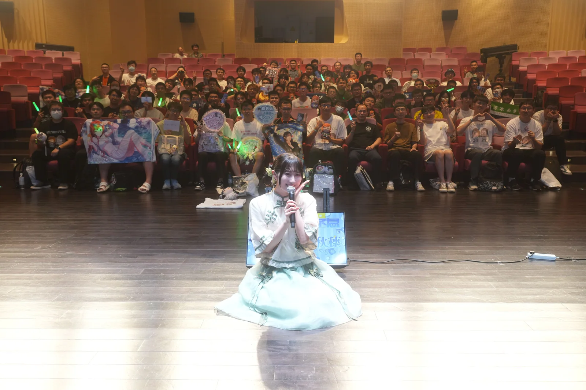
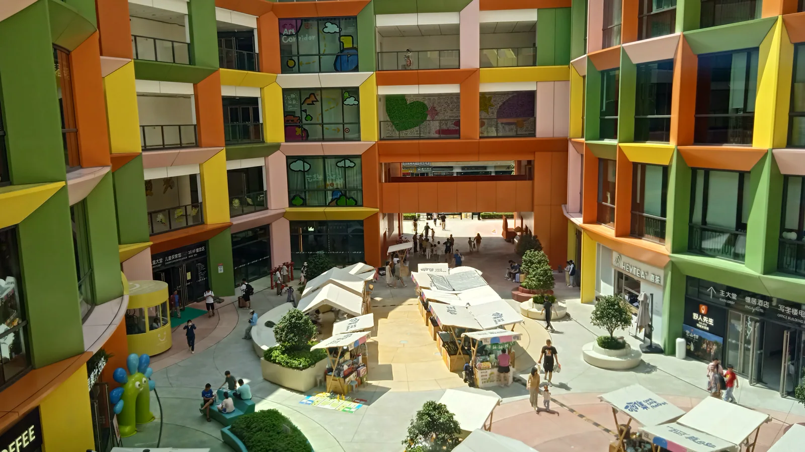
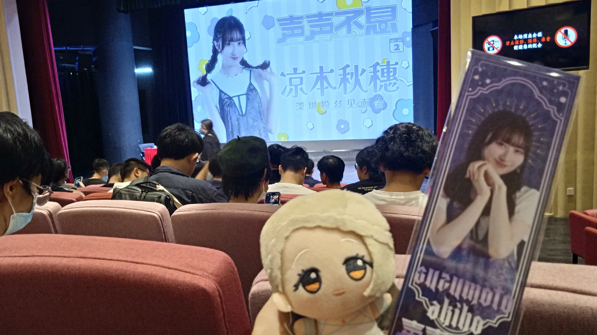
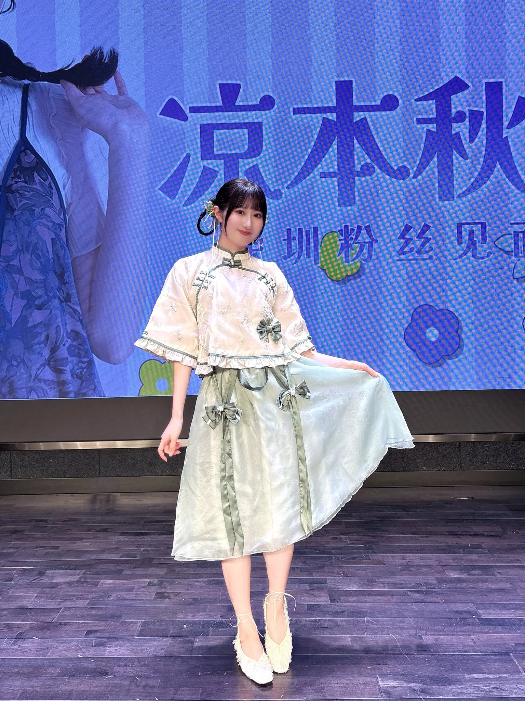
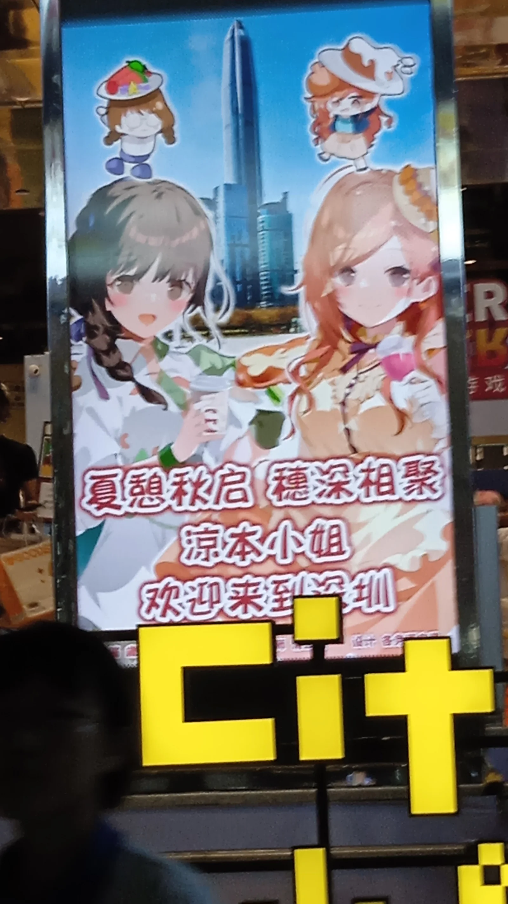
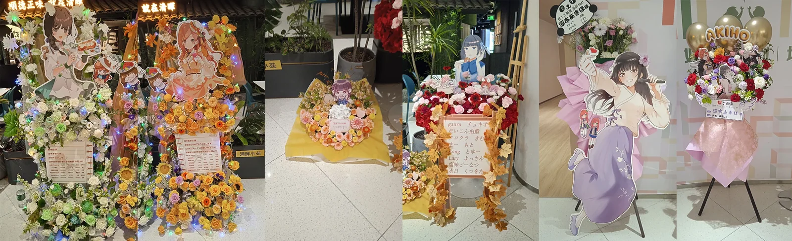
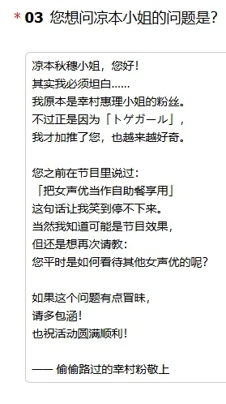
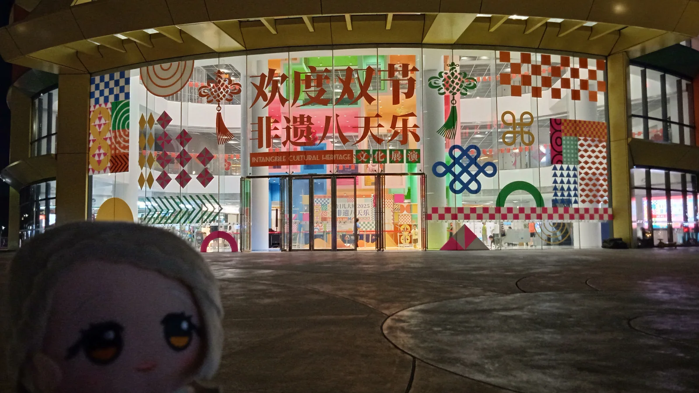

# 被榨干激情的梦幻一天（凉本秋穗FMT纪事）

*个人纪念用，本文掺杂了大量个人无关内容，时序混乱，且高度流水账，一番思索后听了akh夜场的建议写下的这篇repo。*

作为从未参加过声优见面会，甚至从未参与过现地活动，对凉本秋穗本人的了解也仅限于带刺女孩和一些切片的偶像大师爱好者，在10.1之前我是完全无法想象这会是怎样的一天。从因为激动而睡不着又早早醒来，到对融不进大伙而感到自卑和紧张，再到结束后心头萦绕着一股微妙的情感。看来~~nsy确实很有魔力啊~~我确实是很别扭的人呢（笑）

一个月前，突然看到了一则凉本秋穗深圳粉丝见面会的消息，想着来到这里一年了，终于等来了一场活动了，看看时间和日程，念叨着“我不是认知厨”，买了夜场的普票。

9.29晚，因为突然面临了有无比赛可打的问题，和此前一直不太亲密的集训队队友开了场作战会议，和大家关系好像突然就拉进了。因为感受到了奋斗、羁绊、竞争的激情，再想到后天还有akh的fmt，发了“我的大学突然要青春起来了？！”，还引的朋友一众迷惑（笑）

9.30，白天是很唐突的训练赛，但由于涌起的激情，似乎打的不错。晚上似乎是很期待明天的活动，和群友一直吹水到很晚，又规划了明天怎么作行程，在高涨的情绪下又买了昼场的普票，想着难得有时间来还是都去看看吧，最后大概一点半才睡着吧。

10.1早上6:30，很奇怪的醒了，睡得应该挺好，身体没有什么不舒服或疲劳的感受。本想着时间还早，假期多睡会，但看来是胸中的悸动更胜一筹，还是爬起来洗漱了。清醒后又在镜子前试了好一会的衣服，希望能穿得像个人样，最后还是很无奈的随便搭了一身。一看时间还早，又打算刷刷相关的信息和视频，但完全看不进去。于是选择即刻出发。坐上了地铁的那一刻突然意识到，我忘带电棒了。因为路程很远，地铁上为了转移注意力，一直在看完全无关的创作类教程文档。

上午10:30，我来到了这次活动的场地，妇儿剧场。这是一栋很漂亮的大楼，外壁用鲜艳的色块装饰，很好看。因为正值国庆佳节，这里还有活动和非遗表演，非常热闹，只可惜我无暇欣赏。我马上认识到，或许今天我看的最久的会是这栋大楼和街道上洋溢着笑容的行人吧。

寻找入口的时候，先看见了演职员通道的入口，再看到观众入口聚集的人群。似乎是有点不习惯，我马上逃走了，连照也没拍。一时无事，就去吃了午饭。

中午12点，离入场就只有1个小时了，我又来到了入口旁边。大家已经开始排起了场贩。我也去看了一下，些微纠结后还是没买。最后还是在连廊看着楼下热闹的集市活动吹风。

12:50，快开始了。入口已经没多少人了，我很快就检完票进场。这应该是一个很不错的场地。舞台没有架高，前排能直视演出者；观众席是阶梯式的，后排也不用担心看不到。唯一美中不足的是我只是普票，座位在最角落。开场前staff念的观前提醒是中日粤三语的，让大伙都笑了。最后发现原来和群友是连番，笑着交换了名片，心中的异样感降低了不少。

13:00，观众席灯光暗了下来。首先是翻译出来介绍暖场：“相信大家都迫不及待看到凉本小姐了，让我们再次用热烈的掌声欢迎凉本秋穗小姐！”。白色西装配上眼镜很温文儒雅，应该是一位很专业的翻译吧。随后凉本秋穗是小跑着出场的，昼场的她穿着一身设计感很好的民国风的衣服，扎着环式小麻花辫，很有气质。不过看上去还有点紧张，按着台本做了自我介绍和开场后，观众的热情和日语能力让她很吃惊，一声声「かわいい」换来了她的「ありがとう」，有点遗憾的是没能喊出那句「回って」。

落座后，她提到这身衣服是她昨天下飞机后看到才买的，感叹这边服装的设计感非常好。之后还吃到了肯德基和北京烤鸭，很喜欢肯德基的葡式蛋挞，还看到了次元小镇的投屏，很喜欢。

活动的第一个环节应该是观众来信问了什么又回答了什么已经记不清了，只能看着别人的repo才能回忆起来。只记得回复某一封来信时提到了喜欢北京烤鸭的皮加上葱、黄瓜的卷饼。昼场来信环节好像也没有问写了的人是否来到现场，还有一位坐在中间的老哥挥了半天的棒子但好像没得到回应。

第二个环节应该是凉本王的现场版，答对所有问题的人可以获得akh亲手题名的证书。前面的问题我回答的都很顺利，大概连对了5题左右。有一题是

「对凉本秋穗小姐来说，最容易接受的惩罚是什么？」

A：一个人去鬼屋探险。

B：一个人玩超高蹦极。

C：吃生的蔬菜（正解。前面感叹中国的蔬菜都是炒制的熟食，不像日本都是生吃，终于愿意吃蔬菜了）

还有一题是「最喜欢看女声优的哪里？」

A：脸。（正解）

B：上半身。

C：下半身。

万幸都答对了，当时还想着难道我有机会获得凉本王称号吗。但之后还是错了两题，记得一题是

「疲劳的时候会如何放松？」

A：吃好吃的（正解）

B：出去玩（不确定）

C：远眺女声优

这题我选错成了C，akh解释说因为想近看不想远眺，应该是营业吧。不过我还真是只了解那几个节目上的她呢。

还有一个综艺环节是猜词游戏。要求akh根据来场观众齐声喊的一个单词来猜出题目。只要答对了三题，就能获得肯德基葡式蛋挞的小礼物。当时隔壁群友还说不会是楼下刚买的吧（笑）。日语苦手+第一次参战的拘谨+临场反应的迟钝，让我几乎没怎么参与其中。不过因为温柔的staff，还是顺利地挑战成功了，大家都很开心。

综艺环节后，是mini live。只有两首歌，而且我都没听过。第一首是akh很喜欢的偶像的曲子，而第二首歌只记得歌词里有「ハオ」这个单词。一番查找后发现第一首是《最上級にかわいいの》，第二首就完全不知道了。

虽然好像大家也都不怎么熟悉这两首曲子，但call声还是很整齐的。忘带棒子的我也能跟着大家挥手打call。就连akh也惊讶日本宅文化在这里也有啊（笑）

live结束后，是商品推介，都很可爱，设计感也很好，只可惜我没敢买。

在结束前，翻译突然让大家一起唱生日歌，在大家齐声的歌唱下，staff端出了一个大概9寸的蛋糕。akh很开心，连说了好几句「ありがとう」。而最让我吃惊的是大家竟然都是唱得日本常见版本的，即第三句是「happy birthday dear あきほ」，果然大家都是重度用户啊（笑）。之后是王冈sama的视频信息，难道之后也要来深吗。

最后一个环节就是签名会了，不过这和我普票也没什么关系，早早离场了。

离场后和刚认识的偶然连番的茱莉亚p群友一起去了次元小镇打卡投屏了，一路上聊了不少，真是一位热情的普罗丢撒啊，让我也放开了不少。没有他，我估计中午就是在某家店的角落欣赏繁华的街景和熙攘的人群吧。可惜因为当天刚好有演出活动，还有一个投屏没能亲眼见到。

下午4:30，我们回到了会场，和早就认识但由于我的怯懦迟迟没能见面的同学兼普罗丢撒在肯德基交换了名片。哦，对了，还有邻座的热情闪友。不过真是人一多，我也就说不出什么话了呢。

5:00，跟着他们回到了入口。借着他们的气势和大家换了七八张名片，就灰溜溜的逃走了。又是在连廊看着好一会的街景，想起来还有花篮没拍，又趁着人少的空档，回到入口拍照。大家花篮做得真好看呢。

5:40，一阵疲劳感袭来，我选择不再站在连廊守望了，快速检票入场，感叹夜场的座位要更好一点。虽说如此，但也就普票的席位，可喜的是前排没有高个子，视野非常好。

6:00，夜场开始了。开场的内容与昼场没太多不同，唯一让我留下印象的是akh朝我这个方向放了很多饭撒。人放开了不少，活动进行也比昼场更顺利，让我不禁想象她中午在后台又做了怎样的复盘。

夜场的一个小游戏环节是「はぁって言うゲーム」，通过演绎固定的台词，让别人猜是在怎样的场景。记得有句「ワン」，akh抽到了为动画中的小狗配音。因为和小型犬、迎接回来时的主人这两个选项很像，以为大家都很纠结，结果大家都在说「もう一回」。还有一个台词是「バカ」，大伙也是都是醉翁之意不在酒，都听爽了。

另一个小游戏是让akh说条件，符合条件的人举手，只有人数渐渐减少才算成功。成功的小奖品是一个港式菠萝包，也是因为温柔的staff，最后挑战成功。

最后是夜场最有趣的念信环节。比起昼场明显要有趣不少，不知道是不是大家都投的夜场，导致选择更多了，而且基本每一封都有问观众席本人来了吗。整体上是一封正经一封玩笑的交替出现，节奏控制的很好。

我的来信是排在第二个出现。当时写的时候还担心是否有点冒犯，虽然主办修改了一些内容，不过能选上还是很开心的。现场坐在角落里也因为这封信，和akh对视了三秒。（想起akh的建议，之一直盯着她的眼睛，所以感觉夜场的对视次数比昼场显著增高）

当这封信出现在大屏上的时候，大家反应非常热烈。似乎akh也被吓到了，大概说了“好过分，明明你们也是这样。”“因为大家都很可爱”之类的话。现场又是一阵阵笑声和「分かる」。

之后还有人问到她配音是最有难度的角色。她很清楚大家基本都是因为夏叶才了解她的，所以也说了不少因为年龄变化，配夏叶的感觉也在渐渐改变。

还有一封是问工作劳累，有什么比较好的放松运动。在akh还在思考的时候，台下观中就喊了G Health Care，让她很吃惊。录节目的时候应该完全没想都这种内容也会跨越海洋吧（笑）

记得还有一封来信，是问akh有没有什么能够更好地享受活动的方法。她很了当直接地说了没有，这是宅宅共同的问题呢。最后提到了她也会去看各种repo，所以建议大家结束后也马上把活动的感受写下来。所以这篇流水账就诞生了（笑）

或许是自己来信被念了，也或许是夜场收到了很多的饭撒和对视，mini live部分的体验没有因为没带棒子而没有参与感。

夜场同样是两首歌，一首是高达鸡夸的op。不同于昼场的冷淡，这首曲子显然知名度就高了不少，还有前排观众的动作致敬。

第二首歌则是akh担任女主cv的动画《满怀美梦的少年是现实主义者》的ED，非常标准的anisong，虽然我依旧不太熟悉。当她刚说出这些情报时，我旁边一直没什么反应的小哥突然双手抱拳作祈祷状。随着歌曲的进行，他也越来越激动，甚至留下的热泪，可惜我当时没带纸巾。最后akh也注意到了现场有好些个哭了的人，或许，这首歌真的意义非凡。真是一首好曲子啊。

夜场最后的散场前，还有hnk的节目预告，和akh昼场是一样风格的华服。有了第一次经验，有了这么完美的体验，我已经开始犹豫下次要不要试试V票呢。

出来后，我没有在门口逗留。我还不太像和别人交谈，怕把这份悸动忘却。一路跑到场馆外。当时是晚上7:30，天已经很黑了。夜晚的风轻吹，似乎能抚平我的情绪。我来回踱步，很想找出是什么让我如此激动，这和曾经屏幕上节目感受的微妙的差别到底是什么。最后也没能得到答案。

晚上8:00，受同学邀请，一起和去了附近的萨莉亚。同去的P大概有八九个人，我的交流很少，思绪还沉浸在那场活动中，还在找寻那个特别之处。

10:30，和同学回到学校。回程是近两个小时的地铁，我怎么聊天，也没看手机，就连最后都差点忘了分别。

11:00，回到宿舍开始搜索大家的感想。

12:00，因为明天还有训练赛，遂早早睡去。

10.2，果不其然的睡过了，迟到了训练赛，加上心不在焉的状态，甚至还抽空去抢hnk的票（可惜犹豫了一会，依旧是两场普票），成绩非常不理想。晚上回到宿舍，突然意识到，这份微妙的情感其实就是心灵上的脱力。因为这梦幻的一天而对其他事物提不起兴趣，就连比赛也提不起斗志。而这种状态我也并不是第一次遇到了，在刚入坑的那个暑假，疯也似的看了许多偶像大师的老节目，我好想要进入到这样的世界里，最好是能一直在一旁守望的空气。为了记录这份情感，我觉得写下这篇文章。

10.3晚，听了无数遍トゲガール的「打ち上げ花火」，这篇冗长的纪事终于是写完了。一边感叹着这场FMT的高完成度，一边对凉本秋穗的有趣。

能喜欢带刺女孩真是太好了！

能两场都来，真是太好了。

如果真的有人能看到这里，那么感谢你。让我们11.2再见。

> 終わりがあること 始めた日からわかってたから

> 本文原发布于哔哩哔哩，作者：2NG仙人星p。[查看原帖](https://www.bilibili.com/opus/1119506031994470441)
