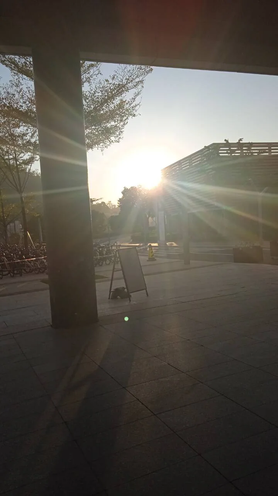
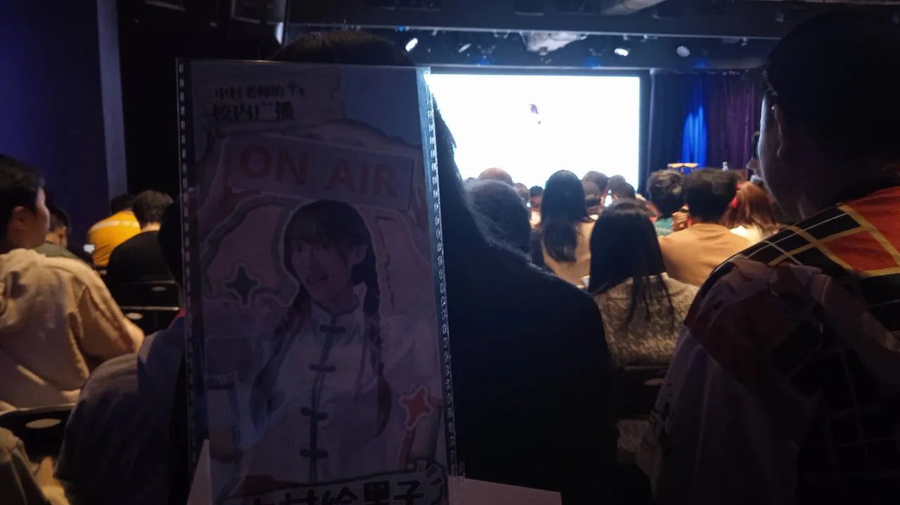
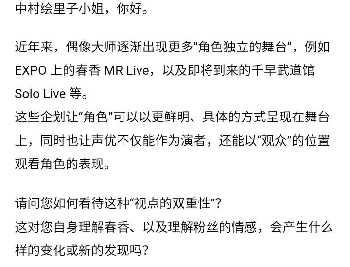
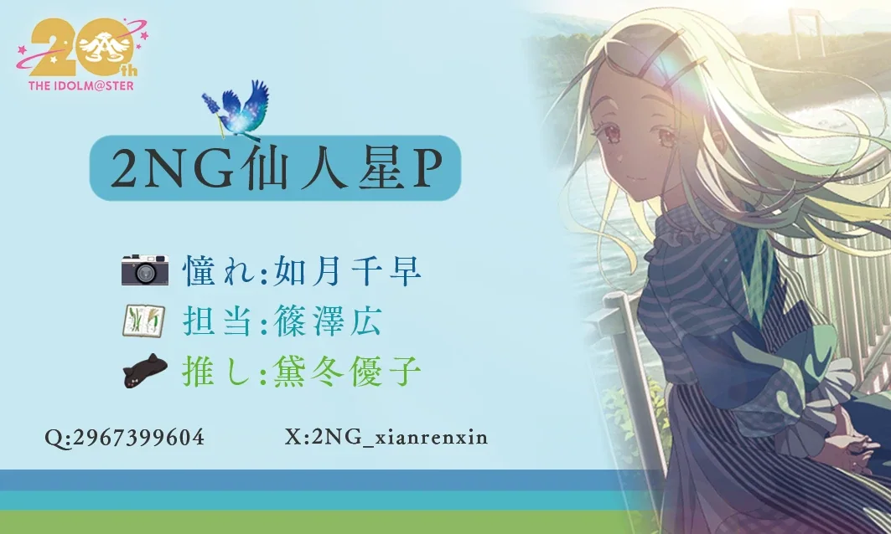
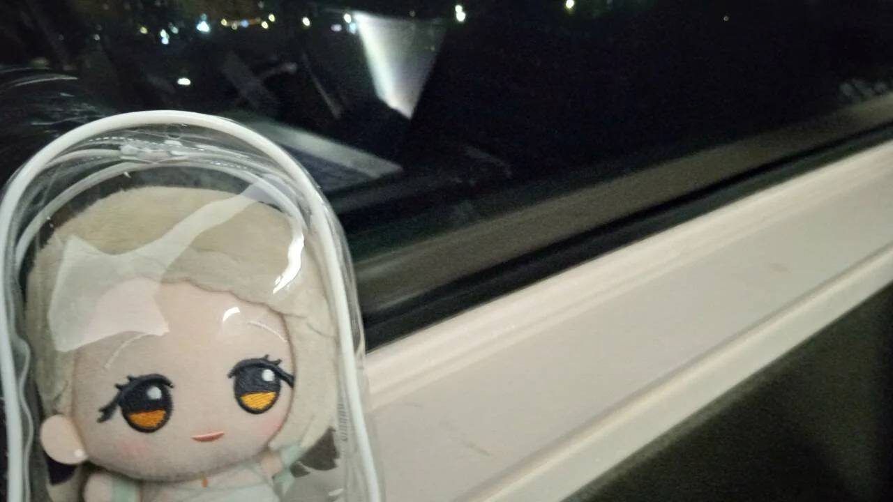

# 幸运小特种兵的中村先生FMT见闻

*个人记录用，本文可能存在张冠李戴，时序混乱、高度流水账等问题，如有冒犯请见谅。*

非常赶的一次fmt，早上6点多起来，一路小跑，地铁转大巴，听着「杯底饲金鱼」佬的本家翻唱歌集，半梦半醒的睡了三个多小时，下车后还迷路了一会，拖着疲惫的身体终于在12：20成功赶到了光芒。

匆匆检票入场，听完本场的翻译kaku中日语播报场前提醒，活动就正式开始了。今天先生是穿着有国风元素的深蓝色连衣裙，似乎是半扎散发，很好看。我这个近视眼从这个10排的高椅神席看去，活脱脱一个不惹眼的小偶像。

开场前的介绍环节就开始展现先生强大的talk能力了，愣是聊了好久才被kaku找到机会切入第一个环节。第一个环节是观众提问环节。由于先生惊人的talk时长，被念的来信只有三封。有一封应该是聊到如何排解生活的怨气，先生回答说“笑吧，尽情的笑出来，就能把所有负能量都宣泄出来，然后就只会接受到开心的情绪了。”。老实说聊天内容有点记不清了，先生讲话实在是太圆滑了（车轱辘话这一块），又久违的体会到知识从大脑皮层滑过的感觉。第三封刚好就是我的信，有点激动。不过有过经验后倒是能够相对正常（大概）的挥棒回应台上传来的目光了。

说实话，这封信我有被选上的自信，很适合大家对先生谈话能力的印象。不过确实主题太大、太正式了，先生并没有正面回答，昼场结束后也被群友说都能够写一篇论文了。

和大伙看到信的热烈反应一样，先生一直是带着“我有话说”的微笑读完的信。读完信后她先是问了我几个问题：“expo去看了吗？”，很显然我只能说：“見てない”。大脑稍微蒙了一会，好像先生说了些什么，我又补充道：“でも、配信で見ます”（唉，我这破口语水平）。可能是照顾没能去到现场的我，又问了我还看了什么，但我似乎是头脑发热会错了意，脑子里只剩下之前聊到过的“never end idol”。先生隔了好一会才听懂我的话，之后接着谈到了前不久弥生伊织的二人MR Live，说“历经二十年，终于看到台上的偶像的独立live了，不过我从二十年前就相信这一天一定会到来的哦。其实我从二十年前就一直是春香的粉丝了，一直等待着能够亲眼看到她登上舞台的那一天。”（现在想来，先生想让我回答的应该是我还看过哪场MR Live）

第二个环节是Tea Break。有三杯饮品，抽选三位幸运观众来品尝，由先生观察品尝时的表情来决定喝那一杯。因为不熟广州的凉茶，就不作记录，大致上是两苦一甜。“第一杯延年益寿、第二杯很美味，第三杯神清气爽。”这是先生得出的观察报告（其实就是三位幸运观众的描述），先生一番试探最后选择了第二杯，果不其然是广州有名的苦凉茶，引得台下好一片笑声。最后则是幸运观众的福利，场贩亲签。羡慕的我马上决定散场后买个帽子（虽然并没有用上）。

第三个环节是先生招牌的“心理咨询室”，温柔贴心，考虑周到，这就是被称为「先生」的中村绘里子啊。时间关系依旧只有两三封信，印象最深的是一封来自春香coser的信，内容大概是“我想要从事想做的行业，但是害怕家人担心，想听听你的建议。”看到是一位穿着春香打歌服的女生，先生先是试探着问了一下是不是想做偶像？“并不是”，“这样啊。嗯~。不过其实不论从事什么行业，家人都会担心的呢。反过来说，会担心你的人就是你的家人呢。所以你只要勇敢的做出选择，为了哪些会担心你的家人而努力吧。因为一个人努力的话会更累吧，而为了他人努力就会更有动力哦。你看我要不是为了春香，可不会在舞台上穿着那么短的裙子跳那么青春少女的舞蹈的（笑）。现在我也为你担心着，或许我也是你的家人呢。所以啊，为了你的家人，也为了我，去从事想做的行业吧。”一番话连带着翻译掌声不断。

第四个环节是互动小游戏，先生做关于广州小知识的趣味答题，而观众来猜她是否能选到正确选项。如果观众才对了即可晋级下一轮，最后角逐出来的两三名胜者将获得上台合影的机会。因为不够相信先生，加上我也不怎么了解广州，所以我在前几轮就被淘汰了，最后坚持到10轮的三位中村领域大神（bushi）最后也顺利获得了合影一张。真好啊。

最后一个环节，DJ Eriko登场，爱马仕神曲频发：开头「キラメキラリ」引爆全场，更有唱跳「GO MY WAY!!」，后面还有my song对口型，似乎大伙也都跟着唱了，最后则是定番的歌马仕结尾。

到此，昼场的所有环节基本结束。之所以说是基本，是因为开场提醒的生日惊喜：大家唱着生日歌，由staff端着小蛋糕出来。大家一起庆祝了先生三天前的生日。感动的先生端着蛋糕就跑到幕后了，留着kaku单独在台上讲话。（这就是霸王吗）。

最后由大伙喊着「アンコール」，先生重新上台。聊了感言感想，最后在一阵阵的感动中，昼场结束。

另外有意思的是，场贩周边介绍环节端上来的“那个盒子”，先生很开心做出了被击中的动作，惹得笑声一片。

出场后的我，跟着汉化组的朋友和群友一起去吃饭了。又跟着逛着一路的地王广场，虽然我的脑子根本还留在幸福的中午。一直到5点回到场地附近，和一直期待另一位汉化组朋友交换了名片（啊，又达成一个成就呢），最后想去露台看看花篮，可惜被告知不让去了，想看得等到v票签完，而这对我这个夜场普票赶火车的人来说，那就是看不到了。唉，还是太特了。不过就像先生说的，带着遗憾到下一个活动吧。

夜场的环节和昼场一样（好像生日庆祝环节都一样？），加上记忆模糊，就不一一记录了，聊聊印象深刻的吧。

记得是应该是来信提问，内容是“对您来说，偶像到底是什么呢”（neta正用，你做的好啊），先生果断回答“是春香哦。其实idol master指的是制作人嘛，那对你们来说，偶像是什么呢？”有人说是「憧れ」，有人说是「命」，也有人说是「アイマス」，还有人开玩笑说是「戦い」，不过最后先生抱怨道，“竟然没有一个人说是我吗”，kaku也一阵煽风点火，观众又纷纷改口，好不热闹。

现场的我对于这个问题并没能做出回答，因为似乎我确实不清楚，偶像对我来说，究竟是什么。可写到这里突然发现，或许我的名片也替我回答了。

还有一个有意思的就是在抽选观众上台试~~毒~~茶的时候刚好抽到了一位春香coser，先生激动得直接说要选择她喝的，结果却又抽中了一味苦茶，令人忍俊不禁。

另外心理咨询室环节是非常硬核的跨国暗恋的恋爱咨询，先生虽然认为大概不会有结果，但还是非常认真的给出了详细的建议。大概是说一定要把自己的态度勇敢的传达给对方，把主动权抓在手里。最后还请幸运观众上台来做演习（听取台下哇声一片）。最后幸运观众一句“我还想和你一起看爱马仕 Live”，惹得全场欢呼鼓掌。

还有的变化就是DJ环节，演唱曲目从「GO MY WAY!!」变成了歌马仕。真不愧是难忘今宵啊，只可惜我最后call喊错了。

夜场出来我一看时间马上一路赶往广州南，出站时还偶遇了同样从FMT赶回来的P，真是「縁」啊。

其实本来从时间安排上是不会来这场，但想着难得来到广州了，还是去看看吧。盯着时间表好一阵调整犹豫，最后前一周幸运的成功把这一天完整的空出来了，马上买票定好行程。

现在回顾，和我参加前两场的差别非常大。eupd似乎有更成熟固定的环节编排和环节推动，而eventer的草台感却也让我感受台上的那份「真挚的」紧张与喜悦。当然对于久经风浪的先生来说，她有着她独特的人格魅力。她的成熟、体贴，她的婉转、欢闹，还有她时不时说出的哲理总能触及到我心底深处。这份二十多年的厚度让她的每一句话都充斥着能量，似乎随时都能击溃我的泪腺。

真的非常开心非常感谢能有机会参加中村先生的FMT。虽然没能在nei踏出那一步，但这次似乎也弥补了一点遗憾了。

言尽于此，让我们带着遗憾、欢笑与感动，去到下一个活动吧！

> 本文原发布于哔哩哔哩，作者：2NG仙人星p。[查看原帖](https://www.bilibili.com/opus/1138505511312818176)
